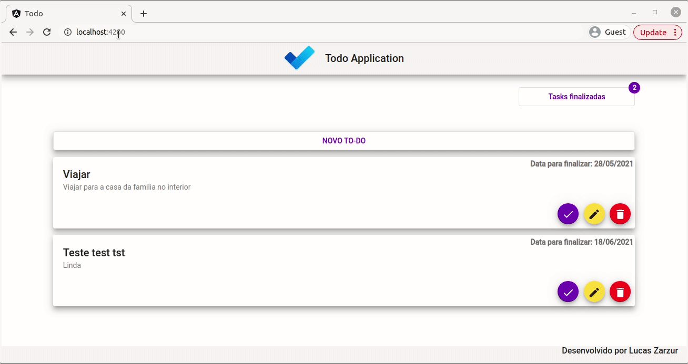

#  To-Do Application :octocat:
An Rest API application developed with Java, Spring boot and Angular 11.

## :page_with_curl: About this project
On this app the user can:
* See a To-Do list;
* See the "finished" To-Do list;
* Finish a To-Do;
* Create a To-Do;
* Update a To-Do;
* Delete a To-Do

## :rocket: Used technologies

This project was developed with the following technologies:

#### Backend

* Java 11
* Spring Boot 2

#### Frontend

* CSS
* HTML
* Angular 11

#### Framework

* Angular Material

#### Communication Protocol

* JSON

## Screenshots :movie_camera:

## Run this project :computer: :computer_mouse:
#### Prerequisites
- Angular 10.0.0
- Npm
- Nodejs

#### Step by step

1 - Clone this repository;
   
2 - Install dependency package to build the project;
  `npm install`
   
3 - Run the project;
  `ng serve`
